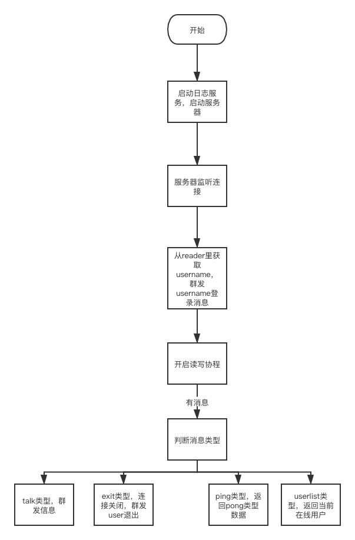

# 技术文档

## 1、整体框架

启动日志功能和服务器监听功能，当有用户连接时将连接升级为websocket，开启读写功能，判断用户发的消息类型，talk类型进行广播功能，exit类型进行退出功能，userlist类型返回在线用户列表，ping pong进行心跳检测

## 2、目录结构

```
.
├── README.md
├── app
│   ├── http
│   │   └── httpserver
│   │       └── wsServer.go
│   └── main.go
├── day5流程图.png
├── go.mod
├── go.sum
├── internal
│   ├── config
│   │   ├── test.pb.go
│   │   └── test.proto
│   ├── ctrl
│   │   └── ctrl.go
│   ├── model
│   │   └── model.go
│   ├── router
│   │   └── router.go
│   └── ws
│       ├── hub.go
│       └── server.go
├── locustfile.py
├── 压力测试报告.html
├── logUtil
│   ├── log.go
│   └── server.logUtil
└── day5流程图.png
    


```

## 3、代码逻辑分层

|   层    | 文件夹                           | 主要职责                                                    | 调用关系                  | 其它说明     |
| :-----: | -------------------------------- | ----------------------------------------------------------- | ------------------------- | ------------ |
| 应用层  | /app/ws/wsServer.go              | 服务器启动                                                  | 调用路由层                | 不可同层调用 |
| 路由层  | /internal/router/router.go       | 路由转发                                                    | 被应用层调用，调用控制层  | 不可同层调用 |
| 控制层  | /internal/ctrl/ctrl.go           | ctrl对ws请求进行参数校验并交由service处理，并且进行服务升级 | 被路由层调用，调用handler | 不可同层调用 |
| message | /test.proto                      | 存放proto相关文件                                           | 被handler、ctrl调用       | 不可同层调用 |
| 工具层  | /logUtil                         | 日志工具                                                    | 被其他层调用              | 不可同层调用 |
|  model  | /model                           | 存放数据结构和全局变量                                      | 被其他层调用              | 不可同层调用 |
|   Ws    | /ws/hub.go    /ws/handlerdata.go | 处理websocket连接的读写管理连接                             | 被ctrl与WS层调用          | 可同层调用   |

## 4、存储设计

通信数据格式 Msg

| 内容     | 数据类形 | Key      |
| -------- | -------- | -------- |
| 消息类型 | string   | msgType  |
| 消息内容 | string   | msg      |
| 用户     | string   | userName |
| 用户列表 | []string | list     |

## 5、接口设计


| 接口地址               | 请求参数         | 响应参数   | 请求方法  |
| ---------------------- | ---------------- | ---------- | --------- |
| ws://localhost:8811/ws | data的二进制数据 | 二进制数据 | websocket |

## 6、第三方库

### gin

```
go语言的web框架
https://github.com/gin-gonic/gin
```

### Gorilla WebSocket

```
go语言对websocket协议的实现
http://github.com/gorilla/websocket
```

### protobuf

```
包含go语言处理proto数据的函数
http://github.com/golang/protobuf/proto
```

### 


## 7、如何编译执行

进入app目录编译

```
go build
```

运行可执行文件

```
./app
```

## 8、todo

将代码进一步分层

## 9、程序流程图

